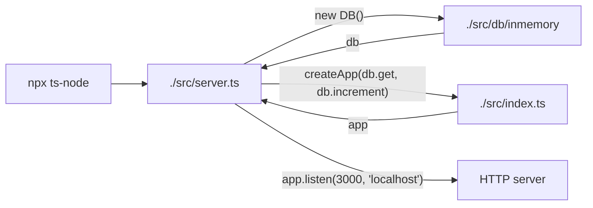
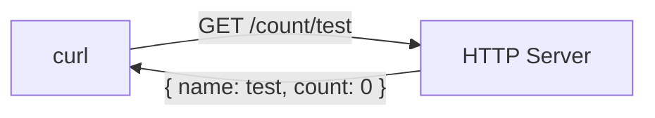
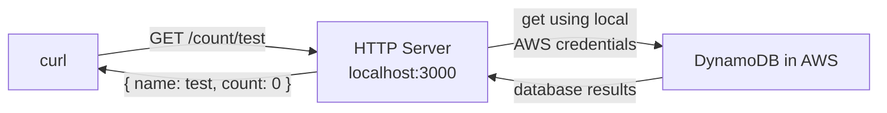
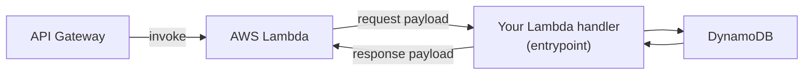

# Serverless development and testing

Adrian Hesketh

@adrianhesketh

https://adrianhesketh.com

https://infinityworks.com

---

# Covered in this session

* Building a basic REST API with Express/TypeScript
* Unit testing your API
* Writing integration tests with DynamoDB Local
* Quick comparison of Serverless tools
* Using CDK to create a DynamoDB database
* Migrating your Express app to Lambda in the cloud
* Migrating your Serverless app to Fargate
* Migrating your Serverless app to Google Cloud Functions

---
layout: two-cols
---

# Code and slides

https://github.com/a-h/serverless-testing

::right::


---

# Make a counter

## `GET /count/:name`

* Returns the `name` and `count` as a JSON object.
* Returns a zero count if a count with the name doesn't exist.
* Returns a 500 status if there's a database error.

## `POST /count/:name`

* Does not require a HTTP body.
* Increments the count of the name by 1.
* Returns the `name` and `count` as a JSON object.
* Creates a count if a count with the name doesn't exist.
* Returns a 500 status if there's a database error.

---

# Tasks

* Create a database to store the counts.
* Create a REST API to handle `POST` and `GET` operations.

---
layout: section
---

# Start with "Hello, World"

---

# Create the project

```bash
npm init -y
npm install --save express
npm install --save-dev @types/express typescript ts-node
mkdir src
```

---
layout: two-cols-header
---

# Create the API

::left::

```ts
import express from "express"

interface Count {
	name: string
	count: number
}

const inmemoryDB: Record<string, number> = {};

async function get(name: string): Promise<Count> {
	const count = inmemoryDB[name] || 0
	return { name, count }
}

async function increment(name: string): Promise<Count> {
	if (!inmemoryDB[name]) { inmemoryDB[name] = 0 }
	inmemoryDB[name]++
	return get(name)
}
```

::right:: 

```ts
const app = express()
app.use(express.json())

app.get("/count/:name", async (req, res) => {
	const response = await get(req.params.name)
	res.json(response)
})

app.post("/count/:name", async (req, res) => {
	const response = await increment(req.params.name)
	res.json(response)
})

app.listen(3000, "localhost", () => { 
        console.log("listening on http://localhost:3000") 
})
```

---

# Checkpoint!

## We have a server we can run that uses an in-memory database.

```bash
npx ts-node ./src/index.ts
```

## We can test it with `curl`.

```bash
curl localhost:3000/count/test123
curl --data "{}" localhost:3000/count/test123
curl localhost:3000/count/test123
```

## We have 2 files we care about.

```
- package.json -> list of dependencies
- src/index.ts -> server and app
- node_modules -> dependencies
- package-lock.json -> list of cryptographic hashes
```

---
layout: section
---

# Write tests for the expected behaviours

---

# Separate handlers from the server

## ./src/index.ts

```ts
import express from "express"

export const app = express()
app.use(express.json())

// <snip>
```

## ./src/server.ts

```ts
import { app } from "./"

app.listen(3000, "localhost", () => {
	console.log("listening on http://localhost:3000")
})
```

<!--
To do this, we first have to separate the code that runs the server from the HTTP handlers.
-->

---

## Setup the testing framework

```sh
npm i --save-dev jest @types/jest esbuild esbuild-jest supertest @types/supertest
```

## ./jest.config.ts

```ts
import type {Config} from 'jest';

const config: Config = {
  verbose: true,
  transform: {
    "^.+\\.tsx?$": "esbuild-jest"
  }
};

export default config;
```

---

# Write tests that match the desired behaviours

```ts
import request from "supertest"
import { app } from "./"

describe("GET /count/:name", () => {
        it("returns the name and count as a JSON object", async () => {
                // Arrange.
                await request(app).post("/count/name1")

                // Act.
                const res = await request(app).get("/count/name1")

                // Assert.
                expect(res.statusCode).toEqual(200)
                expect(res.body).toEqual({ name: "name1", count: 1 })
        })
})
```

---

## Run the tests

```sh
npx jest
```


<!-- 
I like to make the `it` statements read as a sentence that describes the behaviour I'm testing.

It makes the test output clear and understandable.
-->

---
layout: two-cols
---

## `GET /count/:name`

* <mdi-check-circle class="text-green-400" /> `name` and `count` as a JSON object.
* <mdi-check-circle class="text-green-400" /> zero if a count with the name doesn't exist.
* <mdi-help-circle class="text-amber-400" /> 500 status if there's a database error.

::right::
## `POST /count/:name`

* <mdi-check-circle class="text-green-400" /> does not require a HTTP body. 
* <mdi-check-circle class="text-green-400" /> increments the count of the name by 1.
* <mdi-check-circle class="text-green-400" /> `name` and `count` as a JSON object.
* <mdi-check-circle class="text-green-400" /> creates a count if the name doesn't exist.
* <mdi-help-circle class="text-amber-400" /> returns a 500 status if there's a database error.

<!--
How can can we make our database throw an error?

One way would be to update our database code so that if you use a special name, it throws an error.

That's a reasonable approach, but it does mean that our database code has these special edge cases built in.

Another way of dealing with it is to change our app so that we can swap out the database behaviours that the app uses.

In the current design, the `app` is a module-scoped variable, and it directly uses the database code.
-->

---

## Move the database code to its own module

### ./src/db/inmemory/index.ts

```ts
export interface Count {
        name: string
        count: number
}

export class DB {
        data: Record<string, number> = {}
        get = async (name: string): Promise<Count> => {
                const count = this.data[name] ?? 0
                return { name, count }
        }
        increment = async (name: string): Promise<Count> => {
                this.data[name] = this.data[name] ? this.data[name] + 1 : 1
                return this.get(name)
        }
}
```

<!--
Let's move our in-memory database operations into a class in a separate directory.

Splitting the program into two parts, one part dealing with HTTP, and the other dealing with databases is called "separation of concerns".

The idea is that there are clear areas of responsibility in each area. One module deals with HTTP, another one deals with database access.
-->

---
layout: two-cols-header
---

# Use dependency injection

::left::

## Before

```ts
// ./src/index.ts
import express from "express"

export const app = express()
app.use(express.json())

// ...

app.get("/count/:name", async (req, res) => {
  const response = await get(req.params.name)
  res.json(response)
})
```

::right::

## After

```ts
// ./src/index.ts
import express from "express"

type F = (name: string) => Promise<Count>

function createApp(get: F, inc: F): express.Express {
  const app = express()
  app.use(express.json())

  app.get("/count/:name", async (req, res) => {
    const response = await get(req.params.name)
    res.json(response)
  })

  // ...

  return app
}

export { createApp }
```

<!-- 
Instead of importing the database module and using it directly, we can add parameters to the `createApp` function so that we can pass in any function that's the same shape as the `get` or `increment` function.

This idea is called "Dependency Injection", and it allows us to use any database we like. An in-memory database, some code that works with DynamoDB, or a function that throws an error.
-->

---

## Normal operation

```ts
// ./src/server.ts
import { DB } from "./db/inmemory"
import { createApp } from "./"

const db = new DB()
const app = createApp(db.get, db.increment)

app.listen(3000, "localhost", () => {
	console.log("listening on http://localhost:3000")
})
```

<!--

In normal operation, we pass the database functions into the HTTP handlers.

-->

---

## Code structure



---

## Outcome



---

## Force the database code to crash

```ts {1-3|8}
function throwDatabaseError(): Promise<Count> {
        throw new Error("database error")
}

describe("GET /count/:name", () => {
        // ...
        it("returns a 500 status if there's a database error", async () => {
                const errorApp = createApp(throwDatabaseError, throwDatabaseError)
                const res = await request(errorApp).get("/count/fail")
                expect(res.statusCode).toEqual(500)
                expect(res.body).toEqual({
                        status: 500,
                        msg: "internal server error",
                })
        })
        // ...
})
```

<!--
Now we can write a function that simulates a database failure by throwing an error, and use it in the test.

The test fails because we haven't actually implemented the functionality.
-->

---

## Force the database code to crash

```ts {8}
function throwDatabaseError(): Promise<Count> {
        throw new Error("database error")
}

describe("GET /count/:name", () => {
        // ...
        it("returns a 500 status if there's a database error", async () => {
                const errorApp = createApp(throwDatabaseError, throwDatabaseError)
                const res = await request(errorApp).get("/count/fail")
                expect(res.statusCode).toEqual(500)
                expect(res.body).toEqual({
                        status: 500,
                        msg: "internal server error",
                })
        })
        // ...
})
```

---

## The test fails

<style type="text/css">
.slidev-layout h1 + p {
  opacity: 1 !important;
}
</style>


<!--
The test fails because we haven't actually implemented the functionality.
-->

---

## Implement the missing behaviour

```ts
function handleError(e: unknown, res: Response) {
	res.status(500)
	res.json({ status: 500, msg: "internal server error" })
}

export function createApp(get: DBOperation, increment: DBOperation): express.Express {
	const app = express()
	app.use(express.json())

	app.get("/count/:name", async (req, res) => {
		try {
			const response = await get(req.params.name)
			res.json(response)
		} catch (e: unknown) {
			handleError(e, res)
		}
	})

	// ...

	return app
}
```

<!-- 

To implement the missing behaviour, the simplest thing is to use a try catch block. In version 5 of Express, this will get easier, since it will handle async errors automatically, but for now, this is what we're left with.

-->

---

# Checkpoint!

* We _still_ have a server we can run that uses an in-memory database.
* We can _still_ use it with `curl`.
* We have unit tests for all of the defined behaviours.
* We have split code into defined areas of responsibility.

## Important files

```
- src/index.ts -> app
- src/server.ts -> server
- src/database/inmemory/index.ts -> database code
```

---
layout: section
---

# Time to get real

<!--
We've been messing about with a fake database. Let's use DynamoDB.
-->

---

# DynamoDB

* Serverless database (autoscales, scales to zero)
* Pay per million read / write operations, plus data stored
* Encrypted at rest, and in transit
* Easy to backup and manage
* AWS IAM authenticated

---

# DynamoDB schema design

<table>
<tr>
<th>
        name (partition key)
</th>
<th>
        count
</th>
</tr>
<tr>
<td>
        test_1
</td>
<td>
        1
</td>
</tr>
<tr>
<td>
        other_name
</td>
<td>
        3
</td>
</tr>
</table>

---

# DynamoDB get

```ts
import { DynamoDBDocumentClient, GetCommand, UpdateCommand } from "@aws-sdk/lib-dynamodb";

export class DB {
        readonly client: DynamoDBDocumentClient
        readonly table: string
        constructor(client: DynamoDBDocumentClient, table: string) {
                this.client = client
                this.table = table
        }
        get = async (name: string): Promise<Count> => {
                const result = await this.client.send(new GetCommand({
                        TableName: this.table,
                        Key: { name },
                        ConsistentRead: true,
                });
                return result.Item ? result.Item as Count : { name, count: 0 }
        }
        // ...
}
```

---

# DynamoDB increment

```ts
export class DB {
        // ...
        increment = async (name: string): Promise<Count> => {
                const result = await this.client.send(new UpdateCommand({
                        TableName: this.table,
                        Key: { name },
                        UpdateExpression: "SET #c = if_not_exists(#c, :zero) + :one",
                        ExpressionAttributeNames: {
                                "#c": "count",
                        },
                        ExpressionAttributeValues: {
                                ":zero": 0,
                                ":one": 1,
                        },
                        ReturnValues: "ALL_NEW",
                })
                return result.Attributes as Count
        }
}
```

---

# DynamoDB increment

```ts {7}
export class DB {
        // ...
        increment = async (name: string): Promise<Count> => {
                const result = await this.client.send(new UpdateCommand({
                        TableName: this.table,
                        Key: { name },
                        UpdateExpression: "SET #c = if_not_exists(#c, :zero) + :one",
                        ExpressionAttributeNames: {
                                "#c": "count",
                        },
                        ExpressionAttributeValues: {
                                ":zero": 0,
                                ":one": 1,
                        },
                        ReturnValues: "ALL_NEW",
                })
                return result.Attributes as Count
        }
}
```

---

# DynamoDB increment

```ts {15}
export class DB {
        // ...
        increment = async (name: string): Promise<Count> => {
                const result = await this.client.send(new UpdateCommand({
                        TableName: this.table,
                        Key: { name },
                        UpdateExpression: "SET #c = if_not_exists(#c, :zero) + :one",
                        ExpressionAttributeNames: {
                                "#c": "count",
                        },
                        ExpressionAttributeValues: {
                                ":zero": 0,
                                ":one": 1,
                        },
                        ReturnValues: "ALL_NEW",
                })
                return result.Attributes as Count
        }
}
```

---
layout: statement
---

# How do we know if it's going to work?

---

# Write integration tests

* Create a new DynamoDB table
* Carry out the tests
* Delete the table

<!--

It's too slow to create new tables in the cloud.

-->

---

# DynamoDB local options

* Run with Java

```sh
java -Djava.library.path=./DynamoDBLocal_lib -jar DynamoDBLocal.jar -sharedDb
```

* Run with Docker

```sh
docker run -p 8000:8000 amazon/dynamodb-local
```

* Use this workaround if you've got an M1 Mac

https://taint.org/2022/02/09/183535a.html

<!--

I don't like to use Docker in my day-to-day workflow. It uses RAM and CPU.

-->

---

# Test structure

```ts {4}
describe("DynamoDB", () => {
  describe("increment", () => {
    it("creates a record if one does not exist, and sets the initial value to 1", async () => {
      const testDB = await createLocalTable();
      try {
        // Arrange.
        const db = new DB(testDB.client, testDB.name);

        // Act.
        const actual = await db.increment("test1")

        // Assert.
        expect(actual).toEqual({
          name: "test1",
          count: 1,
        });
      } finally {
        await testDB.delete();
      }
    });
  })
})
```

---

# Test structure

```ts {7}
describe("DynamoDB", () => {
  describe("increment", () => {
    it("creates a record if one does not exist, and sets the initial value to 1", async () => {
      const testDB = await createLocalTable();
      try {
        // Arrange.
        const db = new DB(testDB.client, testDB.name);

        // Act.
        const actual = await db.increment("test1")

        // Assert.
        expect(actual).toEqual({
          name: "test1",
          count: 1,
        });
      } finally {
        await testDB.delete();
      }
    });
  })
})
```

---

# Test structure

```ts {18}
describe("DynamoDB", () => {
  describe("increment", () => {
    it("creates a record if one does not exist, and sets the initial value to 1", async () => {
      const testDB = await createLocalTable();
      try {
        // Arrange.
        const db = new DB(testDB.client, testDB.name);

        // Act.
        const actual = await db.increment("test1")

        // Assert.
        expect(actual).toEqual({
          name: "test1",
          count: 1,
        });
      } finally {
        await testDB.delete();
      }
    });
  })
})
```

---

# Test structure

```ts
describe("DynamoDB", () => {
  describe("increment", () => {
    it("creates a record if one does not exist, and sets the initial value to 1", async () => {
      const testDB = await createLocalTable();
      try {
        // Arrange.
        const db = new DB(testDB.client, testDB.name);

        // Act.
        const actual = await db.increment("test1")

        // Assert.
        expect(actual).toEqual({
          name: "test1",
          count: 1,
        });
      } finally {
        await testDB.delete();
      }
    });
  })
})
```

---

# Test helper

```ts
const createLocalTable = async (): Promise<TestDB> => {
  const options = {
    region: "eu-west-1",
    endpoint: "http://localhost:8000",
    credentials: { accessKeyId: "5dyqqr", secretAccessKey: "fqm4vf" },
  };
  const ddb = new DynamoDBClient(options);
  const tableName = randomTableName();
  await ddb.send(new CreateTableCommand({
    KeySchema: [{ KeyType: "HASH", AttributeName: "name" }],
    TableName: tableName,
    AttributeDefinitions: [ { AttributeName: "name", AttributeType: "S" } ],
    BillingMode: "PAY_PER_REQUEST",
  })
  return {
    name: tableName,
    client: DynamoDBDocumentClient.from(ddb),
    delete: async () => {
      return await ddb.send(new DeleteTableCommand({ TableName: tableName }));
    },
  };
};
```

---

# Test results

<style type="text/css">
.slidev-layout h1 + p {
  opacity: 1 !important;
}
</style>


---

# Checkpoint!

* We now have a DynamoDB implementation of the database code.
* We now have have an integration test that uses dynamodb-local.

## Important files

```
- src/index.ts -> app
- src/index.test.ts -> app tests
- src/server.ts -> local server entrypoint
- src/database/inmemory/index.ts -> in-memory database code
- src/database/dynamo/index.ts -> dynamodb code
- src/database/dynamo/index.test.ts -> dynamodb integration tests
```

---
layout: section
---

# Time to get cloudy

---
layout: two-cols
---

* Terraform (2014)
  * <mdi-check-circle class="text-green-400" /> HCL
  * <mdi-check-circle class="text-green-400" /> Uses AWS SDK directly
  * <mdi-check-circle class="text-green-400" /> Written in Go
  * <mdi-check-circle class="text-green-400" /> Module ecosystem
  * <mdi-check-circle class="text-green-400" /> Build for GCP, Azure, AWS and more
* Serverless Framework (2015)
  * <mdi-alert class="text-amber-400" /> YAML
  * <mdi-check-circle class="text-green-400" /> Based on CloudFormation
  * <mdi-check-circle class="text-green-400" /> Written in JavaScript
  * <mdi-check-circle class="text-green-400" /> Plugin ecosystem
* AWS SAM (2016)
  * <mdi-alert class="text-amber-400" /> YAML
  * <mdi-check-circle class="text-green-400" /> Based on CloudFormation
  * <mdi-check-circle class="text-green-400" /> Extends CloudFormation
  * <mdi-check-circle class="text-green-400" /> Written in Python

::right::

* Pulumi (2018)
  * <mdi-check-circle class="text-green-400" /> Same as CDK
  * <mdi-check-circle class="text-green-400" /> Build for GCP, Azure, AWS
* AWS CDK (2019)
  * <mdi-check-circle class="text-green-400" /> TypeScript / Go / Node.js / etc.
  * <mdi-check-circle class="text-green-400" /> Based on CloudFormation
  * <mdi-check-circle class="text-green-400" /> High level abstractions
  * <mdi-check-circle class="text-green-400" /> Suitable for infrastructure projects too
* CDKTF (2020)
  * <mdi-check-circle class="text-green-400" /> TypeScript / Go / Node.js / etc.
  * <mdi-check-circle class="text-green-400" /> Based on Terraform
  * <mdi-check-circle class="text-green-400" /> Use Terraform modules
  * <mdi-check-circle class="text-green-400" /> Build for GCP, Azure, AWS, and more

---

# CDK - Create a DynamoDB table

```shell
npm install -g aws-cdk
cdk init app --language=typescript
```

```ts {5-15}
// ./cdk/lib/stack.ts
export class NodeCountExampleAwsLambdaStack extends cdk.Stack {
	constructor(scope: Construct, id: string, props?: cdk.StackProps) {
		super(scope, id, props);

		const table = new dynamodb.Table(this, "Table", {
			partitionKey: {
				name: "name",
				type: AttributeType.STRING,
			},
			billingMode: BillingMode.PAY_PER_REQUEST,
		});
		new CfnOutput(this, "TableName", {
			value: table.tableName,
		});

	}
}
```

```shell
cdk deploy
```

---

# CDK output

<style type="text/css">
.slidev-layout h1 + p {
  opacity: 1 !important;
}
</style>


---

# Wire up to local server

```ts {14}
// ./src/server.ts
import { Count, createApp } from "./"
import * as inmemory from "./db/inmemory"
import * as dynamo from "./db/dynamo"
import { DynamoDBClient } from "@aws-sdk/client-dynamodb";
import { DynamoDBDocumentClient } from "@aws-sdk/lib-dynamodb";

function getDynamo(tableName: string): dynamo.DB {
        console.log(`getting DynamoDB client for table ${tableName}`)
        const documentClient = DynamoDBDocumentClient.from(new DynamoDBClient({ region: process.env.DYNAMODB_REGION }))
        return new dynamo.DB(documentClient, tableName)
}

const db = process.env.TABLE_NAME ? getDynamo(process.env.TABLE_NAME) : new inmemory.DB()
const app = createApp(db.get, db.increment)

app.listen(3000, () => { console.log("listening on port 3000") })
```

```shell
TABLE_NAME=NodeCountExampleAwsLambdaStack-TableCD117FA1-148EA78Z35U1P npx ts-node src/server.ts
```

---

# Wire up to local server

```ts {7-12}
// ./src/server.ts
import { Count, createApp } from "./"
import * as inmemory from "./db/inmemory"
import * as dynamo from "./db/dynamo"
import { DynamoDBClient } from "@aws-sdk/client-dynamodb";
import { DynamoDBDocumentClient } from "@aws-sdk/lib-dynamodb";

function getDynamo(tableName: string): dynamo.DB {
        console.log(`getting DynamoDB client for table ${tableName}`)
        const documentClient = DynamoDBDocumentClient.from(new DynamoDBClient({ region: process.env.DYNAMODB_REGION }))
        return new dynamo.DB(documentClient, tableName)
}

const db = process.env.TABLE_NAME ? getDynamo(process.env.TABLE_NAME) : new inmemory.DB()
const app = createApp(db.get, db.increment)

app.listen(3000, () => { console.log("listening on port 3000") })
```

```shell
TABLE_NAME=NodeCountExampleAwsLambdaStack-TableCD117FA1-148EA78Z35U1P npx ts-node src/server.ts
```

---

# Wire up to local server

```ts
// ./src/server.ts
import { Count, createApp } from "./"
import * as inmemory from "./db/inmemory"
import * as dynamo from "./db/dynamo"
import { DynamoDBClient } from "@aws-sdk/client-dynamodb";
import { DynamoDBDocumentClient } from "@aws-sdk/lib-dynamodb";

function getDynamo(tableName: string): dynamo.DB {
        console.log(`getting DynamoDB client for table ${tableName}`)
        const documentClient = DynamoDBDocumentClient.from(new DynamoDBClient({ region: process.env.DYNAMODB_REGION }))
        return new dynamo.DB(documentClient, tableName)
}

const db = process.env.TABLE_NAME ? getDynamo(process.env.TABLE_NAME) : new inmemory.DB()
const app = createApp(db.get, db.increment)

app.listen(3000, () => { console.log("listening on port 3000") })
```

```shell
TABLE_NAME=NodeCountExampleAwsLambdaStack-TableCD117FA1-148EA78Z35U1P npx ts-node src/server.ts
```

---

## Outcome



<!--

We can use DynamoDB from our own computer. There's no need to always launch everything to the cloud.

-->

---
layout: section
---

# Let's move the compute to the cloud!

---

# Lambda architecture



---

# Lambda entrypoint (handler)

```ts
// src/lambda/index.ts
import { Context, APIGatewayProxyResult, APIGatewayEvent } from 'aws-lambda';

export const lambdaHandler = async (event: APIGatewayEvent, context: Context): Promise<APIGatewayProxyResult> => {
    console.log(`Event: ${JSON.stringify(event, null, 2)}`);
    console.log(`Context: ${JSON.stringify(context, null, 2)}`);
    return {
        statusCode: 200,
        body: JSON.stringify({
            message: 'hello world',
        }),
    };
};
```

---

# Express adaptor

```sh
npm install serverless-http
```

```ts {2,11-12}
// src/lambda/index.ts
import serverless from "serverless-http";
import { DB } from "../../../../db/dynamo"
import { createApp } from "../"
import { DynamoDBClient } from "@aws-sdk/client-dynamodb";
import { DynamoDBDocumentClient } from "@aws-sdk/lib-dynamodb";

const documentClient = DynamoDBDocumentClient.from(new DynamoDBClient({ region: process.env.DYNAMODB_REGION }))
const db = new DB(documentClient, process.env.TABLE_NAME)

const app = createApp(db.get, db.increment)
module.exports.handler = serverless(app)
```

<!--

* This same approach can be used in Go, or in other programming languages.

-->

---

# Ecosystem benefits

```ts
import morgan from "morgan"
import { IncomingMessage, ServerResponse } from "node:http"

function jsonLogging(tokens: morgan.TokenIndexer, req: IncomingMessage, res: ServerResponse): string {
  return JSON.stringify({
        time: tokens.date(req, res, 'iso'),
        method: tokens.method(req, res),
        url: tokens.url(req, res),
        status: tokens.status(req, res),
        responseSize: tokens.res(req, res, 'content-length'),
        userAgent: tokens['user-agent'](req, res),
        remoteIp: tokens['remote-addr'](req, res),
        referer: tokens.referrer(req, res),
        protocol: `HTTP/${tokens['http-version'](req, res)}`,
        response_time: tokens['response-time'](req, res),
        total_time: tokens['total-time'](req, res),
  })
}

const app = express()
app.use(morgan(jsonLogging))
```

---

# CDK - Create a Lambda function

```ts {8-12}
// ./cdk/lib/stack.ts
export class NodeCountExampleAwsLambdaStack extends cdk.Stack {
	constructor(scope: Construct, id: string, props?: cdk.StackProps) {
		super(scope, id, props);

		// ...

		const countPostFunction = new NodejsFunction(this, "CountPostFunction", {
			entry: path.join(__dirname, "../../node-count-example/src/http/count/post/lambda/index.ts"),
		});
		table.grantReadWriteData(countPostFunction);

		// ...
	}
}
```

```shell
cdk deploy
```

* <mdi-warning class="text-amber-400" /> <mdi-docker class="text-blue-400" /> If you don't install `esbuild` into your project, CDK will try to use Docker.

---

# CDK - Connect the Lambda function to API Gateway

```ts {7-12}
// ./cdk/lib/stack.ts
export class NodeCountExampleAwsLambdaStack extends cdk.Stack {
	constructor(scope: Construct, id: string, props?: cdk.StackProps) {
		super(scope, id, props);

		// ...
		const api = new apigatewayv2.HttpApi(this, "Api")
		api.addRoutes({
			path: "/count/{proxy+}",
			methods: [apigatewayv2.HttpMethod.POST],
			integration: new HttpLambdaIntegration("CountPostIntegration", countPostFunction),
		});

		new CfnOutput(this, "ApiEndpoint", { value: api.url as string });
	}
}
```

---
layout: two-cols-header
---

# Deploying 

```sh
cdk deploy
cdk deploy --hotswap
cdk deploy --watch
```

- <mdi-warning class="text-amber-400" /> The `--hotswap` flag deliberately introduces CloudFormation drift to speed up deployments
- <mdi-warning class="text-amber-400" /> It should only be used for development - never use it for your production Stacks!

---
layout: two-cols-header
---

# Getting the logs

::left::

```sh
curl https://xxxxx.amazonaws.com/count/test123
saw get CountGet --fuzzy
```


::right::

* https://github.com/TylerBrock/saw
  * Written in Go
  * I use my fork: https://github.com/a-h/saw
* Also rans
  * sam logs
  * sls logs
  * https://github.com/jorgebastida/awslogs

<!--

* Don't bother logging into the console
* Serverless Framework and SAM support getting logs for specific functions.
* CDK doesn't, so you need a separate tool.
* I use a fork of saw.

-->

---

# Speed tips

* Get your app logic working well locally first
* Use unit tests for the fastest feedback
* Avoid Docker
* Use a fast transpiler/bundler for Node.js projects
* Don't get stuck waiting for CI/CD to deploy
* Don't bother logging in to the console to read logs
* Hotswap your code changes

---
layout: section
---

# Containers

---

# Dockerise it - get the dependencies

```dockerfile
# Install dependencies only when needed
FROM node:16 AS deps
WORKDIR /app

# Install dependencies based on the preferred package manager
COPY package.json yarn.lock* package-lock.json* pnpm-lock.yaml* ./
RUN npm ci

# Get local esbuild.
RUN mkdir esbuild && \
    curl -fsSL -o esbuild.tgz https://registry.npmjs.org/esbuild-linux-arm64/-/esbuild-linux-arm64-0.15.7.tgz && \
    tar xf ./esbuild.tgz && \
    cp ./package/bin/esbuild ./esbuild && \
    rm -rf package
```

---

# Build the app

```dockerfile
# Rebuild the source code only when needed
FROM node:16 AS builder
WORKDIR /app
COPY --from=deps /app/node_modules ./node_modules
COPY --from=deps /app/esbuild ./esbuild
COPY . .

RUN npm run build-ci
```

---

# Create the production container

```dockerfile
# Production image, copy all the files and run
FROM node:16 AS runner
WORKDIR /app

ENV NODE_ENV production

RUN addgroup --system --gid 1001 nodejs
RUN adduser --system --uid 1001 app

COPY --from=builder /app/dist ./

USER app

EXPOSE 3000

ENV PORT 3000

CMD ["node", "server.js"]
```

---

# Create a Docker image

```ts
        const image = new DockerImageAsset(this, "DockerImage", {
                directory: path.join(__dirname, "../../node-count-example"),
                platform: Platform.LINUX_ARM64,
        })
```

---

# Create a task

```ts
        const taskDefinition = new FargateTaskDefinition(this, "TaskDefinition", {
                runtimePlatform: {
                        operatingSystemFamily: OperatingSystemFamily.LINUX,
                        cpuArchitecture: CpuArchitecture.ARM64,
                },
        });
        table.grantReadWriteData(taskDefinition.taskRole)
        taskDefinition.addContainer("Web", {
                portMappings: [{ containerPort: 3000 }],
                image: ContainerImage.fromDockerImageAsset(image),
                environment: { TABLE_NAME: table.tableName, DYNAMODB_REGION: region },
                logging: new AwsLogDriver({ streamPrefix: "NodeCountExample" }),
        });
```

---

# Run it as a service

```ts
        const service = new ApplicationLoadBalancedFargateService(this, "LoadBalancedService", {
                assignPublicIp: true,
                taskDefinition,
        })
        service.targetGroup.configureHealthCheck({
                path: '/healthcheck',
                protocol: Protocol.HTTP,
                interval: cdk.Duration.seconds(5),
                timeout: cdk.Duration.seconds(3),
                healthyThresholdCount: 3,
        })
        new CfnOutput(this, "EndpointURL", { value: service.loadBalancer.loadBalancerDnsName })
```

---
layout: section
---

# Multi-cloud!

---
layout: two-cols
---

# CDKTF

* Uses Terraform providers to deploy all sorts of things
  * Snowflake
  * GCP
  * Azure
  * AWS

::right::

# GCP

* Lambda -> Cloud Functions
* DynamoDB -> Cloud Firestore

---

# Implement the database interface

```ts
// ./src/db/firestore/index.ts
import * as admin from "firebase-admin";
import { FieldValue } from "firebase-admin/firestore";

admin.initializeApp()
const db = admin.firestore()

export async function get(name: string): Promise<Count> {
	const record = await db.collection("count").doc(name).get()
	if (!record.exists) {
		return null
	}
	return record.data() as Count;
}

export async function put(name: string): Promise<Count> {
	await db.collection("count").doc(name).update({
		"count": FieldValue.increment(1),
	})
	return get(name);
}
```

---

# Create a Cloud Function entrypoint

```ts
// ./src/http/count/cloudfunction/index.ts
import { HttpFunction } from '@google-cloud/functions-framework';
import express = require('express');
import * as countGet from "../get"
import * as countPost from "../post";
import * as db from "../../../db/firestore";
import { requestLogger } from "../../requestlogger"

const app = express()
app.use(express.json())
app.use(requestLogger)

app.get(countGet.route, countGet.create(db.get))
app.post(countPost.route, countPost.create(db.put))

export const fn: HttpFunction = app;
```

<!--

* We're reusing the HTTP handler logic, but implementing a new database and entrypoint.

-->

---

# cdktf

```sh
cdktf deploy
```

```ts
class MyStack extends TerraformStack {
        constructor(scope: Construct, name: string) {
                super(scope, name);

                const credentialsPath = path.join(process.cwd(), "google.json");
                const credentials = fs.existsSync(credentialsPath)
                        ? fs.readFileSync(credentialsPath).toString()
                        : "{}";

                new GoogleProvider(this, "Google", {
                        region: "us-central1",
                        zone: "us-central1-c",
                        project: "quantum-plasma-316913",
                        credentials,
                });
```

---

# Create the database and function

```ts
        // Create a Cloud Firestore. This requires an AppEngine project.
        new AppEngineApplication(this, "app-engine-app", {
                locationId: "europe-west",
                databaseType: "CLOUD_FIRESTORE",
        })
```

---

# Store the code in a bucket

```ts
        // Create a bucket to put the code in.
        const codeBucket = new StorageBucket(this, "bucket", {
                name: "a-h-node-count-storage-bucket",
                location: "EU",
        });

        // This requires that the Cloud Function has already been built (i.e. esbuild has been run).
        // See the package.json file for node-count-example, for the build script (cloudfunction-build).
        const asset = new TerraformAsset(this, "cloud-function-asset", {
                path: path.join(__dirname, "../node-count-example/src/http/count/cloudfunction/dist"),
                type: AssetType.ARCHIVE,
        });

        const codeObject = new StorageBucketObject(this, "archive", {
                name: asset.fileName,
                bucket: codeBucket.name,
                source: asset.path,
        });
```

---

# Create the function and give it permission

```ts
        const cloudFunction = new CloudfunctionsFunction(this, "count", {
                name: "fn",
                runtime: "nodejs16",
                availableMemoryMb: 256,
                sourceArchiveBucket: codeBucket.name,
                sourceArchiveObject: codeObject.name,
                triggerHttp: true,
        })

        new CloudfunctionsFunctionIamBinding(this, "invoker", {
                cloudFunction: cloudFunction.name,
                members: ["allUsers"],
                role: "roles/cloudfunctions.invoker",
        })

        new TerraformOutput(this, "cloudFunctionUrl", {
                value: cloudFunction.httpsTriggerUrl,
        })
```


---
layout: two-cols
---

# Summary

* Structuring your code in modules lets you:
  * Test components in isolation
  * Use mocks or in-memory databases
* Using common interfaces like `express` lets you:
  * Use the wider ecosystem:
    * Logging (e.g. `morgan`)
    * Authentication middleware
  * Switch out later with minimal changes
* Serverless doesn't have to be vendor lock-in
* CDK works great

::right::

# Code

https://github.com/a-h/serverless-testing


